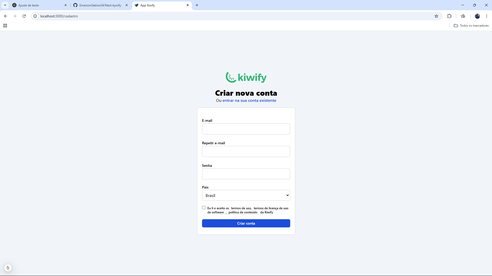
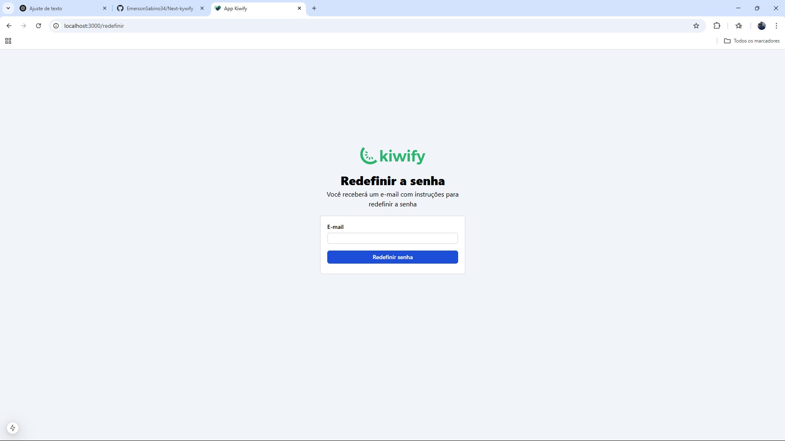

### Como ficou o projeto!

### Atualizações
* > [ ] melhroar interface
* > [ ] validar os campos
* > [ ] controle de estados do css
* > [ ] textos com controles de mesagens em em baixo

### Tela de Login

## Tela de Cadastro

## Tela de Redefinir Senha

